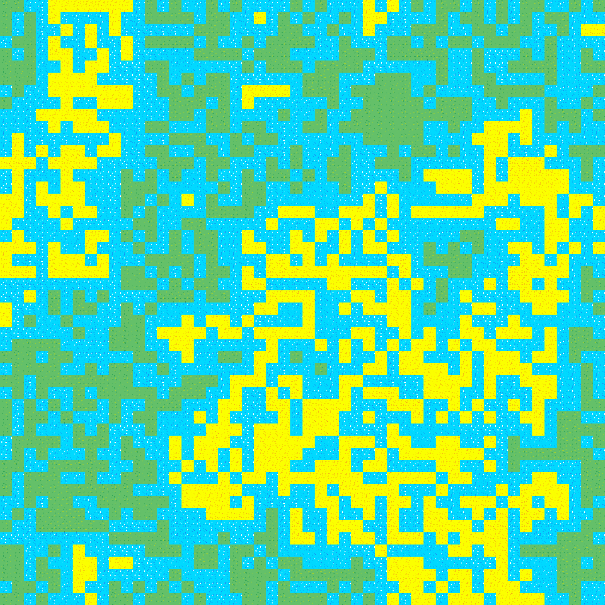
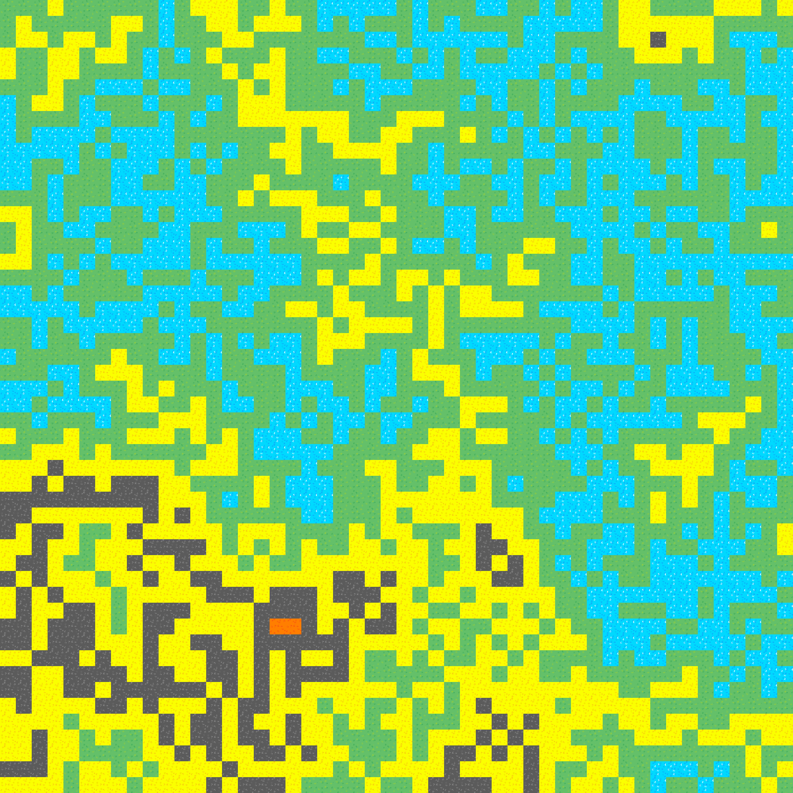
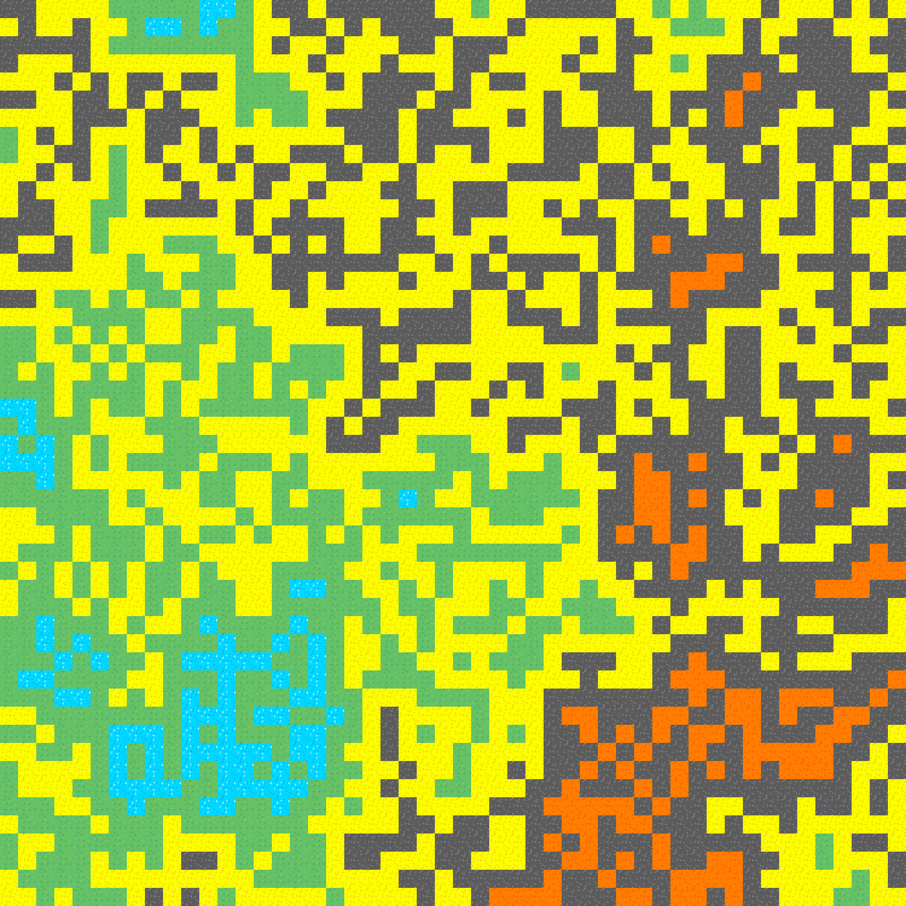

# Wave Function Collapse Terrain Generator 🧩🟩🟦🟨🟥🧩

This project is a simple 2D terrain generator using the **Wave Function Collapse** algorithm.  
It creates a procedurally generated map made of tile images based on adjacency constraints which are hard coded.
Built as a learning experiment to understand how WFC works in Python and how it can be used in procedural generation.

---

## Features:

- Supports square image tiles (e.g., grass, water, soil, rock, lava)
- Generates terrain using constraints
- Renders the final terrain using Pillow (`PIL`) as an image
- Simple and good for demos and learning

---

## How to Run:

1. Install required libraries: `pip install pillow`

2. Make sure your image tiles are located correctly (adjust paths in `renderer.py` if needed, the tiles have been provided in `Tiles` folder).

3. Change the constraints as needed in `renderer.py`.

3. Run the project.

## Notes
- Only **square tiles** of the same size are supported
- No support for rotation or sample-based training
- You can tweak the `tileProb` dictionary in `wfc.py` to create new rules

## Limitations:
1. It takes time to generate large maps
2. The terrain follows scattered pattern but with the given constraints
3. No seed ability for more controlled terrain generation
4. The code can halt sometimes (Edge case) especially around 100 x 100 map size

## Sample Outputs:

